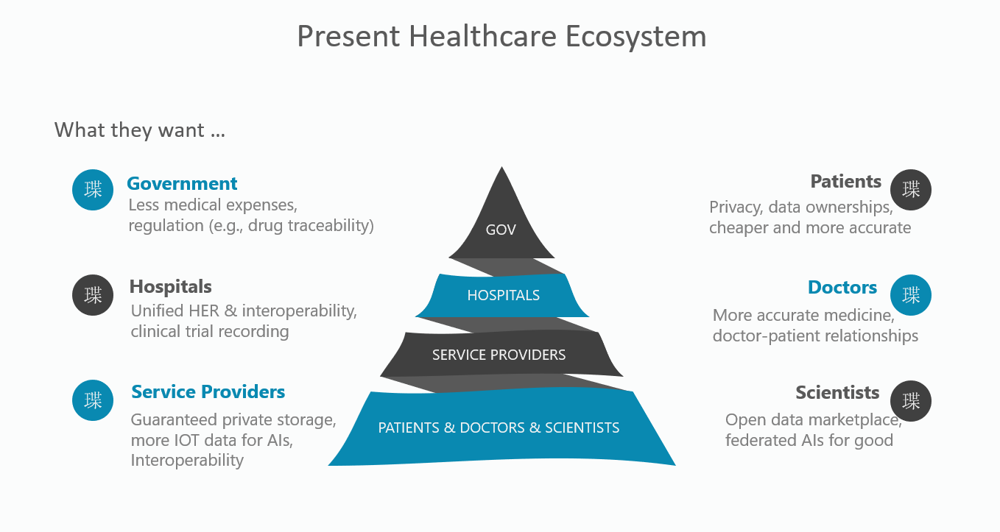
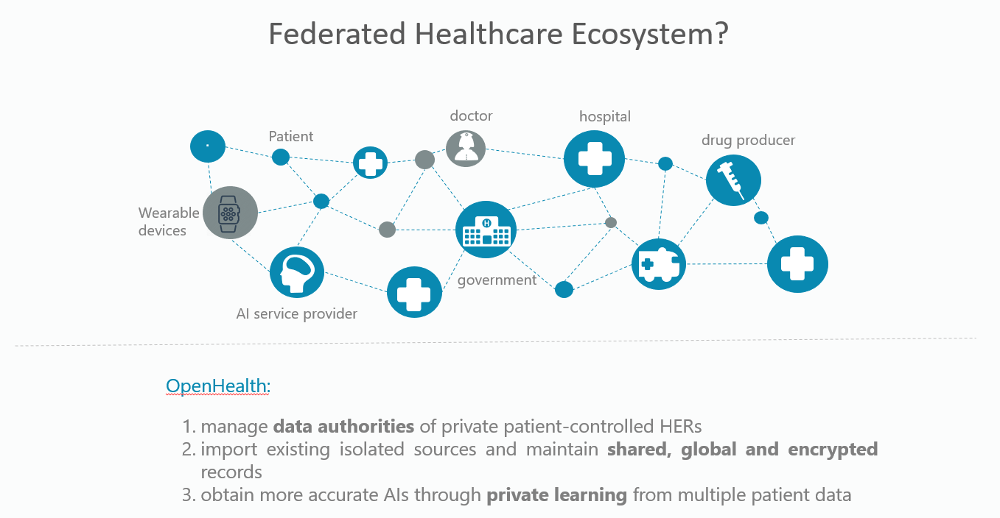
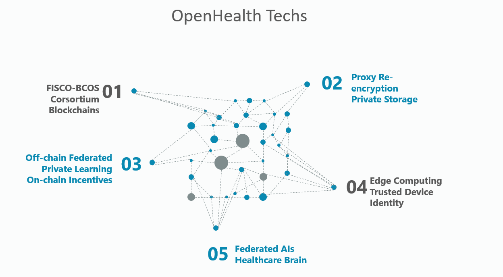
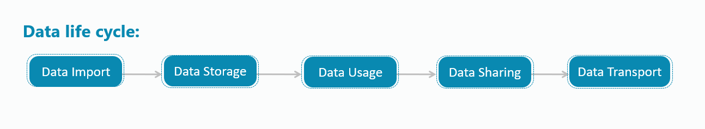
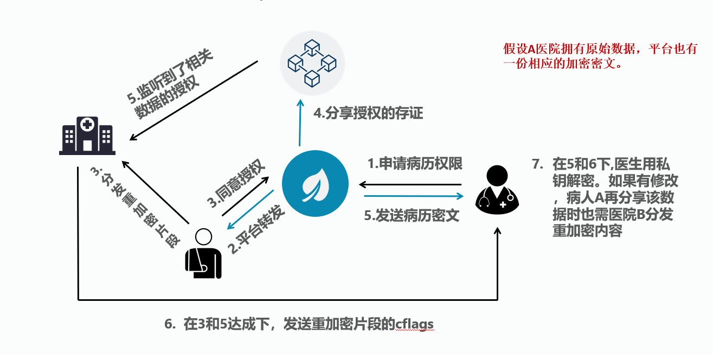
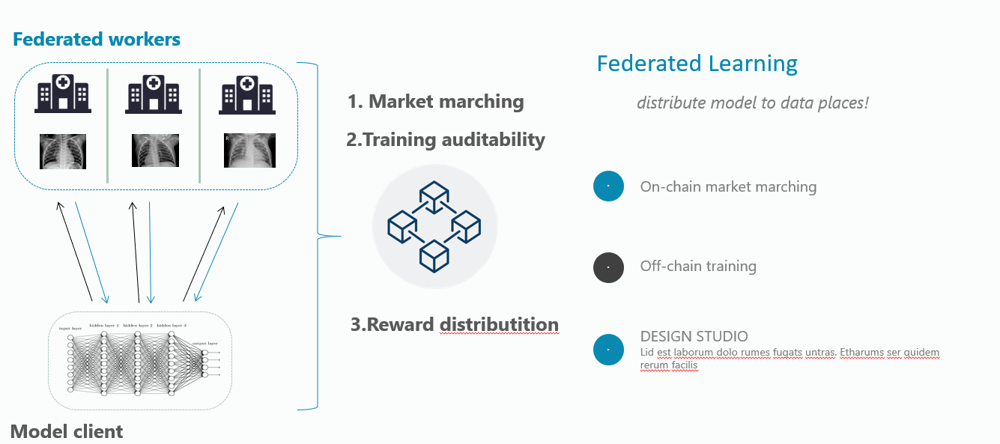

# DoraHacks 7.19 ~ 7.21

Author: Qibing Li, Tianyao Gao, Zepei Lin, Bing W, Hao Ying

## 项目介绍

这次大赛我们将基于Fisco Bcos和代理重加密搭建以患者为中心的医疗数据隐私共享平台，解决当前医疗机构、医疗(AI)服务商、IoT医疗设备之间的数据孤岛问题，并将医疗数据的分享控制权限归还给患者个人，形成一份完整医疗记录。我们还将在基础之上，搭建去中心化的医疗数据市场和AI服务市场，提供联邦学习套件给以上各参与方，将AI模型带到各计算边缘，实现医疗数据隐私保护下的联合机器学习，提高医疗服务的质量。

## 项目背景

以下是当前各个参与方的不同诉求:

- **政府**: 降低人民医疗费用，降低监管成本
- **医院**: 统一的可交互性的电子病例
- **服务提供者**: 确保数据隐私安全，能够在保证安全和隐私的同时让更多的数据能够为AI和交互性提供帮助
- **患者**: 保证数据足够的隐私和安全，同时能够获取更便宜的服务和更精准的治疗结果
- **医生**: 更好的医疗效果，更友好的医患关系
- **科学家**: 开放的数据市场，让AI能够真正为人类更好的服务

## 项目目标

所以，我们现在非常需要一套联合医疗系统，所以我们的目标是创建一套多联邦医疗系统OpenHealth，我们的目标是:

- **更精确的隐私保护和数据确权，让数据回归用户**
- **解决当前医疗系统的数据孤岛与交互性问题**
- **通过隐私的AI学习方法获取更精确的AI模型，让AI能够为更多人服务**

## 技术创新

OpenHealth所涉及到的技术领域有:

- **联盟链**
- **代理重加密**
- **链下隐私联邦学习，链上激励与认证**
- **边缘计算: 可信的设备身份**
- **联邦学习**

## 技术方案

数据的大致流程如下:

详细的数据流程如下:

## 医疗数据与AI市场:

## 项目结构

- `smartContract`: 数据市场和AI模型的合约
- `federated_learning`: 联邦学习上链模块
- `xray-pneumonia-fl-training`: 联邦学习模型复现模块
- `ai_and_blockchain`: FISCO的Java-SDK对接模块与SpringBoot后台模块，包含数据确权/隐私的合约模块
- `python_part`: 代理重加密复现模块
- `ai_blockchain_frontend`: 数据共享、联邦学习、AI市场整合前端模块

## RoadMap

