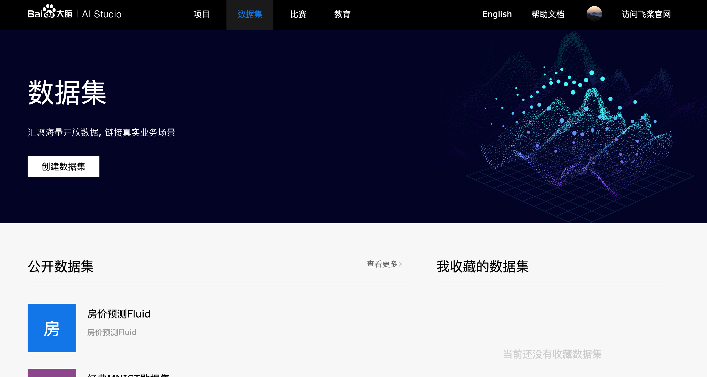
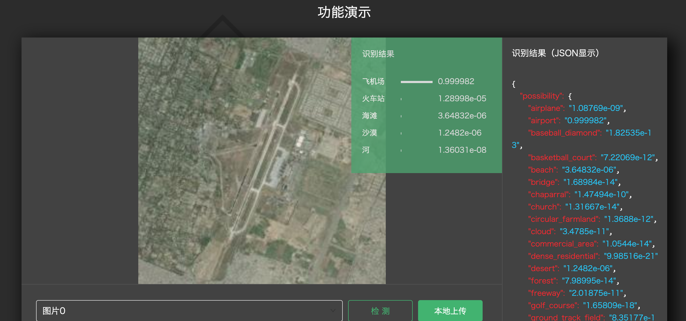

### 主页


### 数据共享

场景描述：**病人A**最近在医院A看过病，现在到新医院B下的医生B看病。医生B向病人A请求查看以往的病例数据查看权限，病人A收到请求，同时最近看过医院A也收到请求，病人A**确认授权**，医院A看到病人A授权。

同时平台A看到了病人A的授权请求通过。

### 分视角

>  1个病人，1个医院，1个平台，新医院1个医生。

**1. 医院A（浙大第一附属医院）**：消息列表，看到医院B的医生B查看了病人A的电子病历 + 治疗简短描述。

​	消息列表： xx医院的xx医生查看了xx病人的电子病历 + 治疗简短描述。

​						xx病人授权了xx医院xx医生的查看请求，医院A已分发重加密钥匙给医生B。

**2.医生B (医院B，北京协和医院)**： 病人数据列表，看到所有病人的**元数据**，包含病人的身份+所属医院。需要加状态(**是否有查看权限**，如果没有权限：申请查看，有权限，直接查看)

​	数据列表：xx病人(xx医院)，最近在xx医院看过病。

​	查看详情：显示X光片图片（**弹窗**显示详情）。

​	请求查看：等待合约确认状态，病人A消息列表新增一条信息，确认或拒绝。确认后，病人A数据可查看。

**3.病人A（病人小林）**： 消息列表。

​	收到xx医院xx医生的查看病例请求。

​	确认 or 拒绝。

**4.平台（OpenHealth平台）**: 消息列表。

​	消息列表： xx医院的xx医生查看了xx病人（医院A）的电子病历 + 治疗简短描述。

​						xx病人授权了xx医院xx医生的查看请求，平台已分发重加密钥匙给医生B，已把病人密文数据发送给医生B。

做一些Fake数据，演示流程时只修改最新的。

4个排列在一块。


### 联邦学习

https://aistudio.baidu.com/aistudio/datasetoverview





**场景**：联邦学习有两个结点，Client，Worker。

**左边**：公开数据集放三家医院的X光片数据集名称+描述。

​	每个条目后面加个CheckBox，选完之后确认Button，发送三个数据集的标识。

**右边**：我的模型需求。

​	X光片检测肺炎AI模型，后面放确认Button。

​	Fake 1

​	Fake 2

确认Button之后，显示模型分发给三家医院的训练过程。

训练结果：完成了可以用于完成需求的AI模型。

**训练动画**，优先级极低，可以不实现：弹框显示A, B, C三家医院，模型是串行训练，在A家训练，显示一个绿点，训练完之后，显示A家训练完毕的Loss。以此类推。

最终完成三家的数据训练。

### AI市场

模型服务列表（3个）：


点击进入后，模型描述 + 功能演示。

图片下拉框显示，点击检测后，标记是否有肺炎即可。左右图对比。左边是原图，右边是检测图。




### 动态生成组件

```js
export default class extends React.Component{
    constructor(props) {
        super(props);
        this.state = {comps : []}
    }
    
    render() {
        const {comps } = this.state; // 解构参数
        return (
            <div>
                {comps.map(comp => {
                    return <BlackComponent key={comp} />
                })}
            <p>---------------</p>
            <button onClick={() => this.setState({comps: comps.concat([Date.now()])})}>加组件</button>
            </div>
        );
    }
}
```


### 元素上直接调节颜色

```html
<Header as="h1" className="data-sharing" color="red">
	数据共享
</Header>
```

