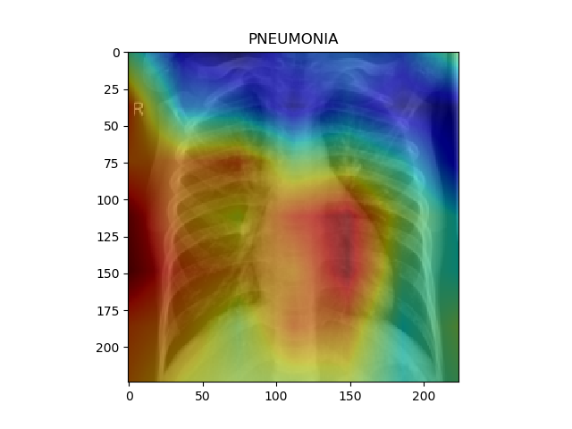

# Federated learning using websockets - X-Ray example

The scripts in this folder let you execute a federated training via three websocket connections.

The script start_websocket_servers.py will start the Websocket server workers for Alice, Bob and Charlie.
```
$ python start_websocket_servers.py
```

The training is then started by running the script run_websocket_client.py:
```
$ python run_websocket_client.py
```
This script
 * loads the chest_xray dataset,
 * distributes it onto the three workers
 * starts a federated training.

 The federated training loop contains the following steps
 * the current model is sent to the workers
 * the workers train on a fixed number of batches
 * the three models from Alice, Bob and Charlie are then averaged (federated averaging)

 This training loop is then executed for a given number of epochs.
 The performance on the test set of chest_xray is shown after each epoch.


# Result

- Patient X-Ray


- AI Model Output


